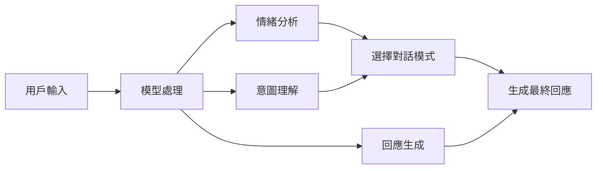
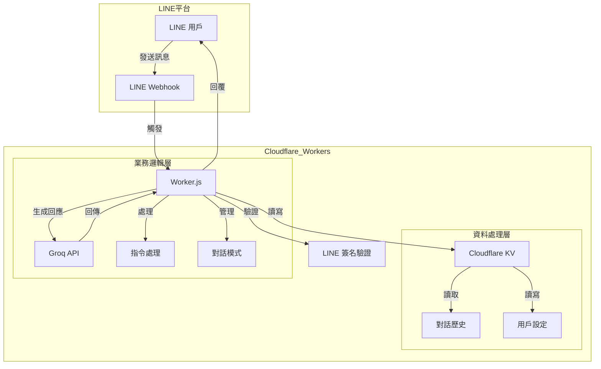
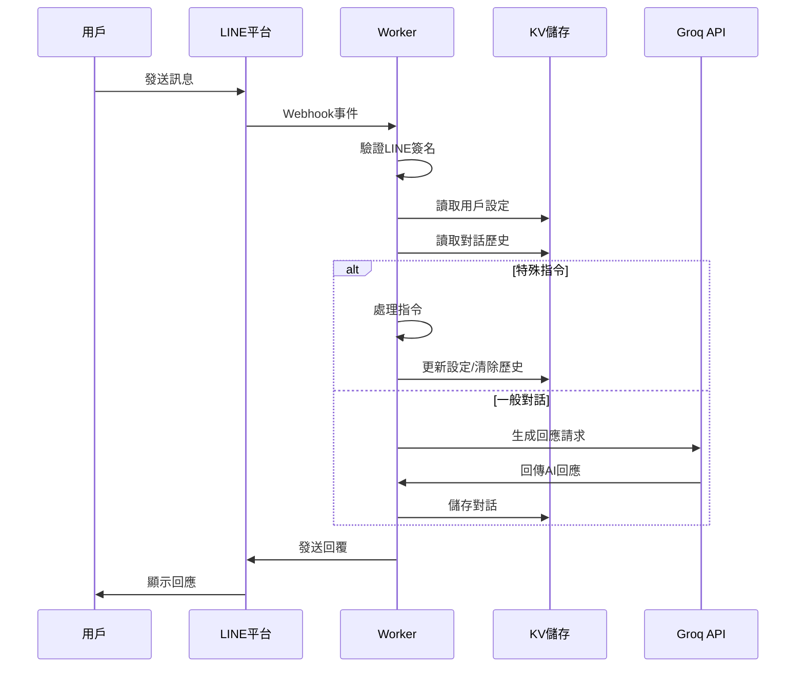
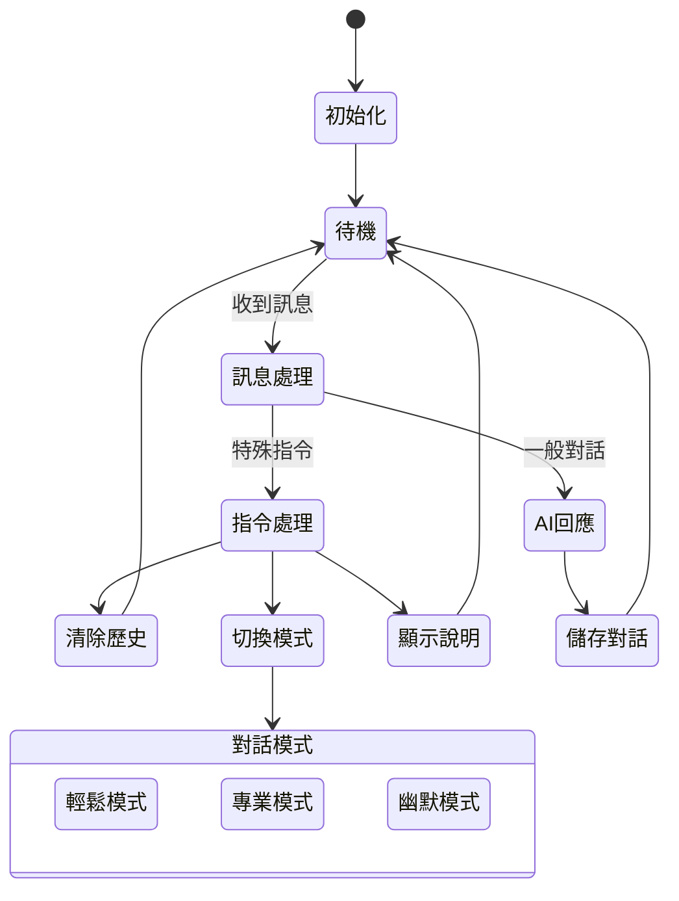

# LINE Bot on Cloudflare Workers

這是一個運行在 Cloudflare Workers 上的 LINE 聊天機器人，使用 Groq API 進行回應生成。

## 系統展示

### 操作展示影片

<video width="100%" controls>
  <source src="範例.mp4" type="video/mp4">
  您的瀏覽器不支援影片播放。
</video>

### 主要功能一覽

| 功能 | 說明 |
|------|------|
| 💬 一般對話 | 支援自然語言對話，記憶上下文 |
| 🔄 切換模式 | 輕鬆/專業/幽默三種對話模式 |
| 🗑️ 清除記憶 | 一鍵清除所有對話歷史 |

## AI 模型說明

### llama-3.1-8b-instant 模型特點
- **快速響應**：針對即時對話優化，回應延遲低
- **8B 參數規模**：平衡了模型能力和運算效率
- **多語言支持**：優秀的中文理解和生成能力
- **上下文理解**：可保持對話連貫性
- **記憶管理**：支援最近 10 組對話的上下文記憶

### 模型應用場景


### 回應生成流程
1. **前處理階段**
   - 提取用戶當前情緒狀態
   - 分析對話意圖
   - 載入歷史對話記錄

2. **模型處理階段**
   - 根據對話模式選擇系統提示詞
   - 結合歷史對話生成上下文
   - 使用 llama-3.1-8b-instant 生成回應

3. **後處理階段**
   - 確保回應的相關性和連貫性
   - 格式化輸出
   - 分割過長回應

### 模型參數設置
```json
{
    "model": "llama-3.1-8b-instant",
    "max_tokens": 300,
    "temperature": 0.7,
    "presence_penalty": 0.6,
    "frequency_penalty": 0.3
}
```

## 功能說明

### 基本功能
- 使用 Cloudflare KV 存儲對話歷史
- 使用 Groq API 生成回應
- 自動選擇適合的模型根據訊息長度
- 支援 LINE 訊息簽名驗證

### 對話功能
- 記憶功能：記住對話內容，保持上下文連貫
- 清除記憶：輸入「忘掉一切吧」清除所有對話記錄
- 查看說明：輸入「請告訴我你能做什麼」查看功能介紹

### 對話模式
- 支援三種對話模式：
  - 輕鬆模式：像朋友般輕鬆聊天
  - 專業模式：提供專業的諮商建議
  - 幽默模式：用幽默感化解壓力
- 可隨時輸入「切換對話模式」進行切換

### 使用者介面
- 快速回覆按鈕：方便使用常用功能
- 自動分割長訊息：確保訊息不超過 LINE 的長度限制
- 支援 CORS：允許跨來源資源共享

## 測試案例

以下是一些測試機器人心理諮商功能的範例問題：

### 工作壓力相關測試
1. "我最近工作常常加班，感覺很疲憊"
2. "團隊的工作進度回報，讓我有壓力"
3. "我想提升工作效率，減少壓力"

### 情緒管理測試
1. "我需要一個安全的方式來抒發情緒"
2. "我想找到不依賴他人的情緒管理方式"
3. "放鬆時聽音樂，但效果短暫"

### 職場人際關係測試
1. "我希望在保持專業的同時，也能維持良好的人際關係"
2. "如何在高壓環境中保持冷靜"
3. "我想找到簡單直觀的工具來協助解壓"

### 自我提升測試
1. "我對自己要求很高，常感到壓力"
2. "想找到平衡工作和生活的方式"
3. "希望能提升情緒管理能力"

### 目標設定測試
1. "我想設定明確的工作目標"
2. "如何逐步提升工作表現"
3. "想找到適合的工作進度管理方式"

每個測試後，請確認：
- 回應是否理解使用者的工作處境
- 是否提供實用的壓力管理建議
- 是否考慮到使用者的個人特質和需求
- 建議是否具體且容易執行

## 系統架構圖



## 資料流程圖



## 狀態管理



## 使用技術

- **Cloudflare Workers**: 無伺服器運算平台，用於部署和運行 LINE Bot
- **LINE Messaging API**: 用於處理 LINE 聊天機器人的訊息收發
- **Groq API**: 使用 llama-3.1-8b-instant 模型生成回應
- **Cloudflare KV**: 用於儲存聊天歷史記錄的鍵值資料庫
- **JavaScript**: 主要開發語言
- **Wrangler**: Cloudflare Workers 的命令列工具，用於開發和部署

## 系統限制
- KV 存儲限制每個對話歷史最多保留 10 組對話
- 請確保已設置所有必要的環境變數
- Worker 的免費版本有請求次數和 KV 操作的限制
